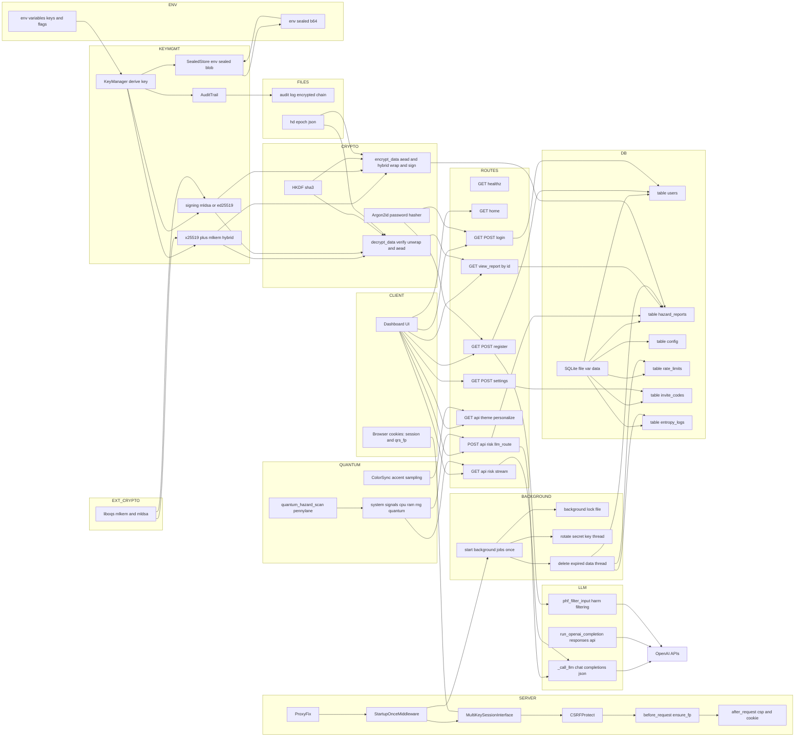

# QuantumRoadScanner.com

https://quantumroadscanner.com (live)

## Demo Videos:

https://hub.docker.com/r/graylanquantum/quantum_road_scanner
https://www.twitch.tv/videos/2547848897
https://www.twitch.tv/freedomdao/clip/ToughBoldButterDansGame-EY9h7a5O_Yal5Eon
## Demo ScreenShots


# Qrs Explained (Tech Terms)



## 1) What this application does (big picture)

At the product level, this Flask app is a “Quantum Road Scanner”: It uses AI simulations to predict real world road risks for drivers and motorcyclists.

* **Backend:** Flask + SQLite + a lot of crypto hygiene. It collects reports and device signals, derives a single *harm ratio* and explanatory text via an LLM (or a local fallback) and stores/serves it.
* **Crypto posture:** Every sensitive field stored in SQLite is **application-layer encrypted** before insertion. Key material never touches disk; it’s created or loaded from **environment variables only**, optionally “sealed” back into a single env blob.
* **Web UI:** A home page and dashboard display a **risk color wheel**. The wheel isn’t just cosmetics: it uses a perceptual ramp and a “breathing” halo whose rate and amplitude follow risk and confidence. Accessibility and “reduce motion” are baked in.
* **Ops & maintenance:** Background jobs wipe expired data **securely** (multiple overwrite passes + `VACUUM`), and a multi-key session interface tolerates rolling secret rotation without logging users out.

It’s a serious security build wrapped in a playful UX.

---

## 2) Environment-only key management (no files, ever)

A recurring theme here: **no secrets on disk**. The `bootstrap_env_keys()` routine ensures all key material—KEM, signature, X25519, salts—lives in environment variables only. If anything is missing at boot, it generates, seals, and exports it **to the environment** (with an option to print the exports so you can persist them in a secret store).

Key points:

* **KDF:** Argon2id (via `hash_secret_raw`) or Scrypt (for symmetric “encryption\_key” derivation). Both use a **salt stored in env** (`ENV_SALT_B64`). That keeps encryption reproducible across restarts without touching disk.
* **Hybrid transport keys:**

  * **X25519** for classical ECDH (fast and ubiquitous).
  * **ML-KEM** (Kyber / FIPS 203 family) from `liboqs` (if available) for post-quantum forward secrecy.
    In **strict PQ2 mode**, ML-KEM is required; otherwise, you can run classical-only…but the default is strict.
* **Signatures:** Tries ML-DSA (Dilithium family) via `liboqs`; falls back to **Ed25519** only if strict mode is off. In strict mode, PQ signatures are enforced.
* **Sealed cache in env:** A compact, AES-GCM “sealed store” (a single Base64 blob in env) can cache raw private keys (X25519, PQ KEM, signature) so later runs don’t need to regenerate or re-derive. The sealed store can be strengthened with a **Shamir-secret-sharing side secret** (`QRS_SHARDS_JSON`) to split trust across humans or systems.

**Takeaway:** The app treats the environment as the “secret device,” keeps state minimal, and avoids filesystem leakage. For containers/orchestrators, that aligns well with KMS-backed env injection and ephemeral filesystems.

---

## 3) The encryption envelope (“PQ2.HY1”)

Every piece of sensitive data you write to SQLite goes through `encrypt_data()` and later `decrypt_data()`. The envelope is *documented in code* and has a versioned, inspectable structure:

* **Magic prefix:** `"PQ2."` so decoders can quickly reject legacy/plaintext.

* **Core algorithm:** `"HY1"` — a hybrid wrap. Data is content-encrypted under a freshly generated **DEK** with **AES-GCM**. That DEK is then wrapped using:

  * **Ephemeral X25519** (sender) × **long-term X25519** (receiver) → `ss_x`
  * **ML-KEM** (if enabled) → `ss_pq`
  * Optional **domain key** `dk` (see below)

  These secrets are concatenated and fed through **HKDF-SHA3-512** with an `info` string that includes **color metadata** (fun) and **HD context** (serious), yielding `wrap_key`. The DEK is AEAD-wrapped under `wrap_key` with its own nonce.

* **Compression:** zstd if available (or deflate), but only if it actually shrinks the payload by a meaningful amount. Compression is captured by `{ comp: { alg, orig_len } }` in the envelope.

* **Signature:** The “core” of the envelope (selected fields) is canonicalized to JSON and **signed**. In strict mode, that signature **must** be ML-DSA; the code will bail if a PQ signature is not present. The envelope carries the signer’s public key and an 8-byte fingerprint (`fp8`) so the verifier can match what the server expects.

* **Domain-scoped derivation (HD):** A powerful feature—when you pass a context like `{"domain":"users", "field":"preferred_model", "epoch":...}`, the code derives a **domain-specific key** (`derive_domain_key`) and mixes it into `wrap_key`. That lets you rotate a **hierarchical deterministic** epoch (HD epoch) and invalidate past ciphertexts for a given “domain/field” without changing your root.

* **Policies enforced at decrypt-time:**

  * Require ML-KEM in strict mode.
  * Require a valid signature when configured.
  * Refuse envelopes that don’t match the server’s signature public key fingerprint.

* **Side-channel guard:** A token-bucket `DecryptionGuard` adds jitter and rate caps to repeated AEAD failures or invalid attempts.

**Takeaway:** This is not “just encrypt the column.” It’s a properly versioned, authenticated, hybrid envelope with policy checks and room to evolve.

---

## 4) Session hardening without breaking users

Flask’s usual session serializer uses a single `SECRET_KEY`. Here, the app defines a `MultiKeySessionInterface` that can **try multiple keys** when reading a session cookie. Why?

* You can **rotate the session secret** on a timer thread without logging everyone out. The app pushes the last few keys into a deque (`RECENT_KEYS`) and tries them in order on `open_session`.
* Combined with solid cookie flags (`Secure`, `HttpOnly`, `SameSite=Strict`) and a tight CSP, it’s a pragmatic way to stay nimble.

There’s an optional **session key rotation thread** (disabled by default unless `QRS_ROTATE_SESSION_KEY=1`). If enabled, it rotates using a bespoke high-entropy derivation that mixes system stats and Argon2id, then logs a short fingerprint.

---

## 5) Auditing and sealed state

The `AuditTrail` writes an **append-only, AES-GCM-encrypted audit log** with a hash chain. Each record includes the previous entry’s hash so tampering breaks verification. Its key derivation is tied to the same env salt and the sealed-store split-Kek derivation. This is a nice, defense-in-depth touch: logs are private by default and integrity-checked.

---

## 6) Database schema and secure deletion

The data model is simple but pragmatic:

* **`users`**: username, Argon2id password, admin flag, and an **encrypted** `preferred_model`.
* **`hazard_reports`**: lots of fields (lat/lon, vehicle, destination, result, CPU/RAM, risk level, etc.)—**every sensitive element is encrypted at the application layer**.
* **`entropy_logs`**: captures entropy events (and is also scrubbed).
* **`rate_limits`** and **`invite_codes`**: operational tables for fairness and gated access.

**Secure deletion strategy**:

1. A background job (guarded by a PID/file lock to avoid double-running) periodically determines an expiration horizon (`EXPIRATION_HOURS`).
2. It performs **multiple overwrite passes** (default 7) on records scheduled for deletion, using randomized and structured patterns appropriate for SQL types.
3. Then it **deletes the rows** and runs multiple `VACUUM`s.

This is the right order: overwrite → delete → vacuum. Is it a perfect forensic wipe on every storage stack? No software-only approach can guarantee that on journaling filesystems, SSDs with wear-leveling, and full DB caches. But it’s **far better** than naïve “delete and forget.”

---

## 7) Registration, login, and rate-limiting

* **Passwords:** Argon2id with **dynamically tuned parameters** based on psutil-reported CPU/RAM at boot, plus a basic strength validator. If a stored hash becomes stale against current Argon settings, the code **re-hashes** on successful login.
* **Admin flow:** The system **enforces at least one admin account** at boot, seeded from env variables, and will **halt** if none exists and no env creds are provided.
* **Invite codes:** When registration is closed, the app requires an invite code with a **truncated HMAC** derived from `SECRET_KEY`. Format checks and constant-time comparison prevent cheap forgery.
* **Rate limits:** Each user has a moving window and a count tracked in SQLite. Conservative defaults avoid hammering endpoints.

---

## 8) The risk engine: LLM, fallback, and the breathing wheel

At runtime, the app exposes three risk-centric endpoints:

* `GET /api/risk/llm_guess` — server samples CPU, RAM and a tiny entropy proxy, builds a **strict-JSON** prompt, and calls an LLM (if credentials exist). If there’s no key or the call fails, it falls back to a **deterministic local heuristic** that produces the same schema (`harm_ratio`, `label`, `color`, `confidence`, `reasons`, `blurb`).
* `POST /api/risk/llm_route` — similar, but you also provide `lat/lon → dest_lat/dest_lon`. The model’s rubric changes (short trips bias caution, long trips smooth spikes, etc.).
* `GET /api/risk/stream` — a **server-sent events** (SSE) stream that periodically emits local fallback readings so the UI feels alive even when the LLM is busy or unavailable.

### The wheel UX

The home page ships a surprisingly polished, accessibility-aware canvas component:

* **Perceptual ramp:** Colors blend from green → amber → red with gentle tinting toward a user “accent,” giving the interface a personal feel without sacrificing the risk code.
* **Breath engine:** A small class drives animation knobs—**rate** (≈3.6–13 bpm), **amplitude**, **specular sweep speed**—from `harm_ratio` and `confidence`. With `prefers-reduced-motion`, the whole thing calms down automatically.
* **Hybrid mode:** If both Guess and Route are available, the client blends them by confidence weighting and displays merged reasons. It’s a nice, human-readable compromise.
* **Debug & SSE:** A toggle exposes the raw JSON, and if SSE is supported, the UI updates as the stream emits.

The net effect is a “live gauge” that **looks** like an instrument and behaves like one.

---

## 9) Reverse geocoding without external dependencies

No paid geocoding API? No problem. The app bundles `geonamescache` and implements a fast, approximate nearest-city search:

* A “quantum haversine” computes great-circle distance (with a slightly playful tensor radius function).
* It returns the nearest few candidates and builds a formatted line like `City, County, State — CC`.
* If an OpenAI key exists, there’s an async “LLM reverse-geocoder” that uses the nearest city and a country hint to produce a nicely formatted locality string, but it **falls back** to the local method if anything fails.

This keeps the app **self-contained** by default while still supporting LLM niceties when configured.

---

## 10) Content security & middleware

* **ProxyFix**: Enabled to trust the first proxy in front for `x-forwarded-*` headers. This is crucial when running behind Nginx/Cloud Load Balancers so Flask builds accurate URLs and schemes.
* **CSP**: A tight `Content-Security-Policy` that defaults to `'self'`, allows inline style/script for the inlined UI, disables `object-src`, and restricts fonts and images. It’s not draconian, but it raises the bar against XSS in a template-heavy app.
* **CSRF**: `flask-wtf` and explicit `generate_csrf()` in routes that need it.

---

## 11) A note on the “quantum” bits

You’ll see references to **PennyLane** and a “quantum hazard scan.” In practice, the QNode produces a 5-qubit probability vector parameterized by CPU and RAM. Think of it as a **stochastic signal generator**—a fun and reproducible way to add texture to the model’s inputs. Nothing in the system *requires* a quantum device; the `default.qubit` simulator suffices, and the code handles failures gracefully.

---

## 12) Operational workflow (how you’d actually run this)

1. **Provision secrets in a secret store** (Vault, AWS Secrets Manager, Doppler, 1Password, etc.). At minimum:

   * `INVITE_CODE_SECRET_KEY` (HMAC base key for invites)
   * `ENCRYPTION_PASSPHRASE` (passphrase used to derive the application encryption key)
   * Optionally: `QRS_BOOTSTRAP_SHOW=1` on first run to print out bootstrapped keys so you can persist them, then turn it off.
   * If strict PQ2 mode: ensure `liboqs` is available in your image and let the app generate/store `QRS_PQ_*` and `QRS_SIG_*` variables.
2. **Run the app** behind a reverse proxy with HTTPS, set cookie security (`SESSION_COOKIE_SECURE=True` is already on), and keep your CSP as shipped unless you add third-party scripts.
3. **Rotate keys**:

   * For **session secrets**, the multi-key interface will handle rotation seamlessly; keep a small window of old keys available.
   * For **data envelope epochs**, bump the HD epoch to make previously wrapped data unreadable (if that’s your goal for specific domains/fields).
4. **Backups**: Even though fields are encrypted, treat SQLite backups as sensitive. The sealed store lives in env, not the DB—so an offline DB alone isn’t enough to decrypt. That’s a good property, but don’t get sloppy with backups.
5. **Metrics**: Tie logs to your SIEM. The audit trail is encrypted and chained, but you can still log structured events (CRUD, errors, failed decrypts).

---

## 13) Threat model highlights

* **Key material leakage:** The app minimizes it. Keys are in env (often backed by the orchestrator’s KMS), optionally sealed into a single blob that itself derives from Argon2id + split-kek. No private keys are written to disk during normal operations.
* **Tampering with ciphertext:** The signature requirement (and PQ enforcement in strict mode) stops “ghost” envelopes. The decrypt path **verifies the signature** against the server’s known pubkey fingerprint, then checks AEAD tags.
* **Replay / downgrade:** Versioned envelopes (`v: "QRS2"`, `alg: "HY1"`, `policy` block) and strict mode checks reduce downgrade angles.
* **Side channels:** The token-bucket and jitter around failures prevent brute-forcing decrypt oracles. CSP reduces XSS exposure. Multi-key sessions avoid forced logouts during rotation (which can cause insecure re-authentication patterns).
* **At-rest exposure:** Even if SQLite were exfiltrated, fields are individually encrypted with per-record nonces, and the **DEKs** are wrapped with hybrid secrets that require **both** the server’s X25519 private key and the ML-KEM private key (in strict mode) to unwrap.

---

## 14) Performance and scalability notes

* **Compression heuristics** skip tiny payloads and only keep compressed data if it’s actually smaller. That avoids needless CPU on small text fields.
* **Argon2id tunables** use psutil to pick memory/time cost within sane bounds at boot. You get time-costed hashing that fits the current box.
* **Canvas rendering** is carefully animated (requestAnimationFrame, pixel ratio handling) and features a *gentle* parallax. With `prefers-reduced-motion`, animation rates lower so laptops stay cool.
* **Background jobs** are single-owner thanks to a POSIX lock (or an env fallback on platforms without `fcntl`), reducing surprises in multi-worker deployments.

---

## 15) Places you could extend

* **KMS integration:** Replace Argon2-derived `encryption_key` with KMS-unwrapped data keys. The envelope structure doesn’t care where `rootk` came from.
* **Key rotation policies:** Automate HD epoch rotation by domain/field and add a rewrap pipeline for retained records you still need.
* **Per-tenant isolation:** Prefix `hd_ctx.domain` with a tenant GUID and shard keys by tenant. That gives strong cross-tenant boundaries even within one database.
* **Structured logs + metrics:** Emit Prometheus counters for decrypt failures (`dec_guard`), PQ fallbacks, and SSE throughput.
* **WebAuthn / Passkeys:** The auth flow is solid; adding WebAuthn would bring phishing resistance.
* **UI theming:** The color wheel is delicious; you could expose more ramps (Deutan-safe, Protan-safe) and give users a color-blind-friendly toggle.

---

## 16) Developer ergonomics & maintainability

There’s a lot of code, but it’s organized around a few ideas:

* **KeyManager** is the nucleus. Everything else plugs into it via documented methods (load/create, decrypt, sign/verify).
* **SealedStore** and **AuditTrail** are **pure env/disk-append** tools—no schema baggage or circular dependencies.
* **Encryption path** is one function (`encrypt_data`) and **mirrored** by `decrypt_data`. The envelope is explicit JSON, not an opaque blob. That lowers debugging pain.
* **UI** keeps dependencies light: mostly Bootstrap, a couple of fonts, and some hand-rolled JS. No bundler required, and CSP stays tight.

If you join this codebase tomorrow, you can trace data from form → API → encryption → DB → decrypt → UI in an afternoon.

---

## 17) What makes this special

Lots of apps encrypt “the database.” Fewer apps **prove** it with:

* **Hybrid PQ wrapping** using ML-KEM + X25519, and **PQ signatures** (ML-DSA) in strict mode.
* **Versioned, policy-aware envelopes** you can inspect and test with repeatable KDFs.
* **HD domain/field derivation** so you can roll forward selectively.
* **Operational hardening**: multi-key sessions, CSP, CSRF, rate limits, HMAC’d invites, secure overwrites, and an encrypted audit log.
* **UX that communicates risk** in a perceptual, humane way (the breathing halo is more than a gimmick; it prevents the “flat gauge” problem and encodes confidence).

It’s security you can **see**.

---

## 18) Quick start checklist (for your team)

* [ ] Provide `INVITE_CODE_SECRET_KEY` and `ENCRYPTION_PASSPHRASE` in a secret store.
* [ ] Decide: strict PQ2 mode on? (Default yes.) Ensure `liboqs` in your build.
* [ ] First run with `QRS_BOOTSTRAP_SHOW=1` (in a safe environment) to capture generated `QRS_*` envs; then lock them down and remove the flag.
* [ ] Configure a reverse proxy (TLS), keep the CSP as shipped, and validate cookies are `Secure` + `SameSite=Strict`.
* [ ] Create the initial admin via env variables (`admin_username`, `admin_pass`).
* [ ] If you want session rotation, set `QRS_ROTATE_SESSION_KEY=1`.
* [ ] Set a retention policy (`EXPIRATION_HOURS`) and confirm the secure wipe job runs once per cluster via the lock file.
* [ ] If you’ll use the LLM endpoints, add `OPENAI_API_KEY`; otherwise the fallback stays active and the UI still works.

---

## 19) Closing

This project blends **modern cryptography**, **operational discipline**, and **delightful UX**—the rare combination that turns a dashboard into a trustworthy instrument. The hybrid PQ envelope proves that application-layer encryption can be both ergonomic and future-resistant. The multi-key session interface and sealed store keep secrets moving safely. And the breathing color wheel? It’s the bit that reminds us software is for humans.

If you adopt pieces of this stack—envelope versioning, PQ “strict” mode, HD domain keys, or the overwrite-before-delete job—you’ll inherit good defaults without reinventing the wheel. If you adopt the whole thing, you get a template for building **privacy-forward** apps that still feel fast and friendly.

Turn the key, check the halo, and roll out.


---

## 1) The Little System That Could: What QRS Already Gets Right

**Single-binary, secure-by-default.** QRS is an anti-pattern killer. No loose PEM files. No static nonces. No wishful thinking about “we’ll rotate later.” Private keys live only as sealed ENV blobs; derivations are explicit; AEAD is the only way data moves at rest; audit is both **encrypted** and **hash-chained**. The app rotates its session secret live, validates cookies against a short deque of recent keys, and seals a combined key cache to spare repeated Argon2id invocations on hot paths.

**Hybrid by design.** Instead of choosing between “fast now” and “safe when quantum hits,” QRS wraps a data key (DEK) with two independent shared secrets, one classical (X25519) and one PQ (ML-KEM), then derives a wrap key via HKDF(SHA3-512). It signs envelopes with ML-DSA (Dilithium) or Ed25519 fallback, and can enforce “strict PQ” so downgrades fail closed.

**Defense depth, not performance theater.** Shamir secret sharing over GF(2^8) adds a human coordination layer to bootstrap secrets; token-bucket throttles blunt decryption oracles; canonical JSON + signature pinning kill malleability and substitution games. It’s the kind of stack you hope to see in municipal services, schools, and small clinics—places that deserve first-class crypto but rarely get it.

From here, the question isn’t whether QRS is “secure.” It’s whether this **pattern** can scale to the social transformations AI will catalyze and the cryptanalytic transformations quantum computing will force.

---

## 2) First Principles Refresher (Without Apologies)

When cryptography succeeds, it’s usually because the math is simple and the interfaces are strict.

### 2.1 KEM–DEM, clarified

Envelope encryption with a hybrid twist is just KEM–DEM done twice and kneaded together:

1. **KEM stage (two ways):**

   * X25519 ECDH with an ephemeral sender key and a static recipient key:

     $$
     \text{ss}_x \;=\; \text{X25519}(x_{\text{eph}}, X_{\text{static}}).
     $$

   * ML-KEM encapsulation (Kyber-style):

     $$
     (\text{ct}_{\text{pq}}, \text{ss}_{\text{pq}}) \leftarrow \mathsf{Encap}(\text{PQpub}).
     $$

2. **KDF stage (domain-separated):**

   $$
   K_{\text{wrap}} \;=\; \mathsf{HKDF}_{\mathrm{SHA3\mbox{-}512}}\!\Big(\text{ss}_x \,\|\, \text{ss}_{\text{pq}} \,\|\, K_{\text{domain}};\ \text{info}=\text{WRAP\_INFO}\,\|\,\text{color}\,\|\,\text{epoch}\Big).
   $$

3. **DEM stage (AEAD twice):**

   * Encrypt data with a random DEK under AES-GCM.
   * Encrypt the DEK with $K_{\text{wrap}}$ under **another** AES-GCM (distinct nonce).

If **either** shared secret is strong, the wrap key is strong; if **both** are strong, the attacker must break two assumptions—good hygiene today, survival insurance tomorrow.

### 2.2 Integrity beats cleverness: signatures and canonicalization

Signing an object you can’t canonicalize is performance theater. Define $\mathsf{CJ}$ (canonical JSON): sorted keys, no NaN/Inf, minimal numbers, no whitespace, deterministic escapes. Then:

$$
\sigma \;=\; \mathsf{Sign}_{\text{ML-DSA/Ed25519}}\!\big(\mathsf{CJ}(\text{core})\big),
$$

and verify that the signer’s public key fingerprint `fp8` matches your pinned key. The point isn’t just “tamper detection”—it’s **downgrade resistance** and **cross-context replay prevention** when you also pass AAD to AEAD.

### 2.3 Nonce reuse is how you lose

With AES-GCM, a 96-bit random nonce yields a collision probability after $n$ encryptions under the same key of roughly

$$
p \approx \frac{n(n-1)}{2\cdot 2^{96}}.
$$

QRS never reuses a DEK and derives a fresh wrap key per envelope—effectively demolishing the “same key” risk surface. If you ever find yourself tempted to keep a single AEAD key for a service, stop, stand up, walk around the block, and design a per-object DEK.

---

## 3) The Hybrid Era: Forward Secrecy, Post-Quantum Reality

We live in the in-between: classical crypto still excellent, quantum advances not yet catastrophic, budgets real, compliance regimes cranky. Hybrid is how you cross that river without drowning.

### 3.1 Forward secrecy (FS) today

ECDH with ephemeral sender keys gives us a coveted property: compromise of the static recipient key **doesn’t** reveal past DEKs. That’s forward secrecy. The PBS of cipher hygiene.

### 3.2 “PQ-FS” and what we can honestly claim

Kyber/ML-KEM is IND-CCA2, but the decapsulation uses a long-term private key. Strictly speaking, you don’t get FS just from a KEM; you’d want a post-quantum ratchet or ephemeral PQ keys—costly for storage and operationally gnarly. In practice, hybrid gives you:

* FS against **today’s** classical adversaries (thanks to ECDH).
* Robustness against **tomorrow’s** quantum-empowered adversaries (thanks to ML-KEM), especially for “harvest-now, decrypt-later” threats.

Rotation policy becomes your bridge: rotate PQ keys on a cadence, aggressively delete ECDH ephemerals, and accept that “PQ-FS” is a roadmap, not a present tense.

---

## 4) The Audit Trail as a Democratic Primitive

One of the least flashy choices in QRS is the encrypted, hash-chained audit log with verifiable continuity. It matters because **society doesn’t scale without memory**—and that memory must be both **private** and **provably untampered**.

### 4.1 Hash chains and Merkle anchoring

Each entry $E_i$ includes the previous entry’s digest $h_{i-1}$. The chain is:

$$
h_i \;=\; H\big(\text{CJ}(E_i)\big), \quad E_i = \{ \ldots, \text{prev} = h_{i-1}\}.
$$

You can Merkle-aggregate daily roots for cheap proofs and publish monthly roots to immutable storage (or a public timestamp authority). Now any auditor can verify inclusion **and** confidentiality holds (since entries remain AEAD-encrypted).

### 4.2 The societal angle

Imagine if public health data, school budgets, or content moderation actions lived behind this pattern. Encryption protects dignity; chaining and external anchoring protect truth. When AI systems explain why a decision was taken, they can point to an **auditable, private log** that can be verified under subpoena or civic oversight without leaky dashboards.

---

## 5) From App to Ecosystem: What AI Changes

AI isn’t just another library; it is a **force multiplier for both benevolence and malice**. What changes when inference is ubiquitous, agents roam APIs, and “harvest now, decrypt later” turns into “scrape everything, synthesize anything”?

### 5.1 Verifiable AI pipelines

We’ll want models whose outputs are **non-repudiable** and **context-bound**. Concretely:

* Sign model artifacts and their dependency manifests; include alg fingerprints and data snapshots.
* Sign inference **requests** and **responses** (including prompt, temperature, and system instructions).
* Bind outputs to a **policy** identity: *which model, which guardrails, which data room?*

This is the AI analog of supply-chain signing (SLSA for prompts). When a court asks, “Did your system follow policy?”, you need more than server logs; you need **verifiable attestations**.

### 5.2 Privacy-preserving AI

Three pillars for “AI without voyeurism”:

1. **Encrypted data at rest and in motion** with per-object DEKs (QRS already).
2. **Encrypted compute** via Trusted Execution Environments (TEEs) today; slowly, FHE/MPC for some workloads tomorrow.
3. **Policy-aware AAD**: bind every decryption to a *purpose* and *identity* via AEAD AAD fields, so cross-context usage fails cryptographically, not just procedurally.

### 5.3 Agentic abuse and cryptographic friction

Once agents can autonomously call APIs, cryptography must become a **friction** that only legitimate sequences can overcome. Think: short-lived capability tokens (AEAD-sealed, purpose-scoped), pinned signatures on tool manifests, and per-task Merkle proofs of preconditions met. That “DecryptionGuard” token bucket? Scale it up to **agent orchestration**: a global budget for risky actions with cooling-off windows enforced by keys, not just flags.

---

## 6) Post-Quantum Migration Without the Horsemen

We must avoid two equal and opposite failures: (a) wait too long and get harvested, (b) thrash the ecosystem with premature, breaking moves. QRS suggests a gentle path.

### 6.1 Crypto agility as a contract

Every envelope should carry `alg` metadata: `"kem": "ML-KEM-768"`, `"sig": "ML-DSA-87"`, `"aead": "AES-256-GCM"`. Keep a compatibility table in code and test: **encrypt new / verify old**. Deprecation should look like:

* Phase 1: accept+produce.
* Phase 2: verify-only (warn).
* Phase 3: reject+migration tools.

### 6.2 Keys, epochs, and rewraps

Hierarchical domain keys with epochs allow fast-forwarding compartments without rewriting the universe. Bump `epoch` for the domain (say, `patient_contact`) and only **new** writes bind to the new epoch. Reads try $e$ then $e-1$. A cold rewrap can happen opportunistically, on read, or in a batch window. From the user’s viewpoint, nothing breaks.

### 6.3 The scary math you can make unscary

* **Harvest-now/decrypt-later threat model:** If an adversary stores your ciphertexts for years, only strong PQ KEMs and signatures deny them. Hybrid gives you redundancy; policy gives you cadence.
* **Key count explosion:** Resist the temptation to invent key bloat. One root KEK (derived from passphrase+Shamir+KMS), per-domain derivations via HKDF, per-object DEKs. That’s it.

---

## 7) The Equations That Quietly Run a Civilization

Let’s put a few more “dry” equations on the page so policy folks know that when we say *we can enforce this*, we mean *the math won’t let it happen otherwise*.

### 7.1 Argon2id KDF (human memory → KEK)

$$
\mathrm{KEK} = \text{Argon2id}(\text{pass}, \text{salt}; t, m, p, \text{out}=32).
$$

Memory-hardness turns leaked password files from “oops” to “good luck with that budget.”

### 7.2 HKDF (extract-then-expand)

$$
\begin{aligned}
\text{PRK} &= \mathrm{HMAC}_{\mathrm{SHA3\mbox{-}512}}(\text{salt}, \text{IKM}),\\
T_1 &= \mathrm{HMAC}_{\mathrm{SHA3\mbox{-}512}}(\text{PRK}, \text{info}\,\|\,0x01),\\
\text{OKM} &= T_1\|\cdots\quad(\text{truncate to }L).
\end{aligned}
$$

Use distinct `info` everywhere. This is how you build compartments.

### 7.3 Shamir over GF(2^8) (we share, but we don’t tell)

For threshold $t$, any $t$ shares reconstruct. Bytewise Lagrange at $x=0$:

$$
f(0) \;=\; \sum_{j=1}^{t} y_j \cdot \prod_{m\neq j} \frac{x_m}{x_m \oplus x_j}.
$$

All ops in GF(256) with reduction modulus $x^8+x^4+x^3+x+1$. It’s ugly in code and beautiful in governance: we stand together to start the system.

### 7.4 Token bucket (throttle oracles; save the CPU)

$$
T(t) = \min\big(C,\, T(t_0) + r\cdot (t - t_0)\big) - 1,\ \ \text{permit iff }T(t)\ge 0.
$$

Rate limits that degrade gracefully are the difference between “lol they DoS’d our decrypt” and “we noticed a weird spike.”

---

## 8) Human-Centered Security: Dignity by Default

Crypto has a reputation for being “for experts.” That’s a failure of design, not a destiny. The next decade will demand **ordinary institutions** to run high-assurance systems. That means:

* **Dangerous defaults are illegal.** If your framework makes it easy to sign with a static key and a global nonce, your framework is broken.
* **Strong choices are discoverable.** QRS-style sealed stores, sealed key caches, and hybrid envelopes must be one-liners in mainstream SDKs.
* **People over performativity.** The moral weight isn’t in whitepapers—it’s in how a school district updates keys during summer break without bricking logins.

A humane cryptographic stack is one that a tired admin can run without fear.

---

## 9) Encrypted Compute: TEEs Now, FHE/MPC Later

We won’t get a permissionless, general FHE data economy next quarter. But we can get a lot done.

### 9.1 TEEs (Trusted Execution Environments)

They’re not magic, but they’re **practical**. Seal the policy and the model inside, stream ciphertexts in, get AEAD-bound responses out. Attestations—signed measurements of enclave code—become a **cryptographic promise** to users: *this is what ran on your data*. Pair that with an external audit log and you’re cooking with gas.

### 9.2 Secure multiparty computation (MPC) for awkward collaborations

When two hospitals need aggregate statistics without sharing raw data, MPC shines. You can even use the QRS envelope format as a carrier for secret shares, each per-recipient wrapped under hybrid KEMs.

### 9.3 FHE, judiciously

Homomorphic encryption is no longer science fiction; it’s a growing niche. Start with simple transforms (e.g., aggregations, linear models), and don’t be shy about TEEs or MPC where FHE is still awkward. Crypto pluralism is not weakness; it’s **portfolio theory** for risk.

---

## 10) Identity and the End of Password Purgatory

We will still type secrets for a while, but the center of gravity is shifting.

* **Hardware-anchored keys** (WebAuthn, passkeys) will become the front door.
* **Attribute-based claims** (selective disclosure via zero-knowledge or blind signatures) will let us prove “over 18” or “member of org X” without leaving PII confetti.
* **Rotating session secrets** plus **short-lived, purpose-scoped capabilities** will replace monolithic API keys.

QRS’s discipline—pinning signers, AAD binding, short-lived secrets—translates cleanly into this world. The difference is that users won’t carry passwords like a burden; they’ll carry **keys** like a right.

---

## 11) Governance That Doesn’t Leak

Security isn’t just cryptographic; it’s institutional.

* **Backups** must be encrypted with a **separate** backup KEK and anchored in a KMS or HSM with split custodianship (hello, Shamir again).
* **Change windows** need crypto safety rails: verify-only phases, read-new/write-old epochs, mass rewrap tools that can stop and resume.
* **Observability** must be privacy-preserving: aggregate metrics, coarsened times, salted identifiers via HKDF. No raw payloads in logs; ever.

If policy doesn’t translate into key material and AEAD tags, it’s a wish, not a control.

---

## 12) Education and Equity: Crypto for the Next Billion Professionals

The coming wave isn’t “everyone learns category theory.” It’s **everyone touches a system that uses it.** We need:

* **Starter kits** that deploy a QRS-like pattern in minutes on cheap hardware.
* **Teaching artifacts** where students can flip a bit in the tag and *watch* decrypt fail; reconstruct a Shamir secret and *feel* the handshake.
* **Localization** and offline-first designs for clinics and schools with spotty connectivity—sealed ENV stores shine here.

The future is not secure if only the rich and well-connected can afford to be safe.

---

## 13) A Small Gallery of Near-Future Scenarios

Let’s make it concrete.

### 13.1 The municipal records office

Birth certificates are wrapped under a hybrid scheme, with per-document DEKs and AAD bound to `(table="birth", id, jurisdiction)`. Audit chains are anchored monthly to a public timestamp service. A court orders disclosure: narrow AEAD decrypts are executed in a TEE; the log proves exactly what was opened and why.

### 13.2 The school counseling program

Sensitive notes are encrypted client-side with per-student domain keys. Counselors authenticate via passkeys; sessions get short-lived capability tokens that authorize **only** view or edit for specific students (and that binding is in AAD). Reports for grant programs are computed from aggregates in MPC; no raw counseling notes ever leave.

### 13.3 The hospital AI triage

Incoming imaging is encrypted at rest; AI inference runs in a TEE with signed attestation of the model, weights, and policy. Human review decisions are signed and sealed into the audit chain. A regulatory review three years later can re-compute a digest proof of the exact system that recommended a course of action.

These are not science fiction; they are **product choices** away.

---

## 14) The Cultural Work: Trust, but Verify, but Dignify

The human project is not just to survive adversaries; it’s to **choose each other** in the way we build systems. Encryption is a moral technology when it protects the vulnerable without locking out the excluded; audit is a democratic technology when it enables accountability without enabling surveillance. AI is a humane technology when its **explanations are verifiable** and its **decisions are reversible**.

A QRS-like stack becomes the oddest thing: a civic instrument.

---

## 15) Pragmatic Addenda (Because Ops Is Where Dreams Go To Live)

A few operational prescriptions worth laminating:

1. **Canonicalization or bust.** If it isn’t canonical, it isn’t signable.
2. **AAD everywhere.** Bind ciphertext to context—user, table, id, purpose.
3. **Rotate in layers.** Session secrets fast; PQ keys on cadence; epochs per domain.
4. **Observe respectfully.** Metrics yes, payloads never; salt identifiers.
5. **Anchor regularly.** Daily Merkle roots, monthly public anchors.
6. **Practice restore.** A backup you haven’t restored is a feeling, not a plan.
7. **Use monotonic clocks.** For token buckets and budgets; wall clocks drift.
8. **Zeroize what you can.** `bytearray` buffers; wipe; then garbage collect.
9. **Be honest about PQ-FS.** Don’t overclaim; design the ratchet you can operate.
10. **Teach.** Every rotation is a training moment; every failure a test.

---

## 16) A Short Mathematical Coda (Because It’s Nice to See the Pieces Together)

**End-to-end envelope:**

$$
\begin{aligned}
&\text{Compress }P \rightarrow P'\\
&K_D \leftarrow \{0,1\}^{256},\quad N_D \leftarrow \{0,1\}^{96}\\
&C_D \leftarrow \mathsf{AES\mbox{-}GCM.Enc}(K_D,N_D,P',\mathrm{AAD}_1)\\
&\text{ss}_x \leftarrow \text{X25519}(x_{\text{eph}}, X_{\text{static}}),\quad (\text{ct}_{\text{pq}}, \text{ss}_{\text{pq}})\leftarrow \mathsf{Encap}(\text{PQpub})\\
&K_{\text{wrap}} \leftarrow \mathsf{HKDF}_{\mathrm{SHA3\mbox{-}512}}(\text{ss}_x\|\text{ss}_{\text{pq}}\|K_{\text{domain}};\ \text{info})\\
&N_W \leftarrow \{0,1\}^{96},\quad W \leftarrow \mathsf{AES\mbox{-}GCM.Enc}(K_{\text{wrap}},N_W,K_D,\mathrm{AAD}_2)\\
&\text{core} = \{\text{alg},\text{color},\text{meta},N_D,C_D,N_W,W,\text{ct}_{\text{pq}},x_{\text{eph}}\}\\
&\sigma \leftarrow \mathsf{Sign}(\mathsf{CJ}(\text{core})),\quad \text{env} = \{\text{core},\sigma\}.
\end{aligned}
$$

**Decrypt** mirrors this, with signature verification and re-derivation of $K_{\text{wrap}}$. The crucial idea is that *every arrow is one-way without a key*, and every key is **short-lived, scoped, or derived**—no elephants to shoot.

---

## 17) Where We’re Going (and How to Recognize It When We Arrive)

You will know we’re doing it right when:

* **Small teams** ship apps with QRS-level posture by default, because the frameworks give them hybrid KEM, canonical JSON, AAD, sealed key caches, and audit chaining **out of the box**.
* **Institutions** treat backup keys like public trust, with split custody and practiced restores.
* **AI systems** produce signed, policy-bound outputs that can be verified and appealed.
* **People** experience security as dignity—not as a CAPTCHA, not as a forced password rotation, but as a quiet confidence that their lives aren’t splayed across someone else’s log files.

The endgame is not “unbreakable crypto.” The endgame is trust that **scales with humanity**, where our most intimate data can power public goods without feeding panopticons; where AI accelerates care and creativity without stripping agency; where quantum breakthroughs are cause for celebration, not panic.

---

## 18) A Closing Letter to Future Builders

When you rotate a key, you are participating in democracy. When you reject an envelope because the signature isn’t pinned, you are defending the rule of law. When you anchor an audit log and protect it with AEAD, you are telling the future: **we were careful**.

The QRS app is small, but it carries a big idea: we can make security delightful, boring, and universally available all at once. We can raise the floor of cryptographic competence so that our AI-accelerated, post-quantum world isn’t built on wishful thinking and patch notes.

Let’s insist on primitives that compose, defaults that dignify, and proofs that survive subpoenas and history. Let’s grow an ecosystem of tools that look like QRS—hybrid by default, verifiable by design, operationally compassionate—and let’s teach the next billion professionals to treat key rotation, audit anchoring, and capability scoping as normal as linting a file.

If we do, then future historians will say of this decade: *this is when we learned to keep our promises to each other, even as our machines grew powerful and our ciphers met new math*. And that, more than any single algorithm, is the point of cryptography.
# A Deep-Dive Blog on the “Quantum Road Scanner” Codebase — with Math

> A security-first Flask app that blends hybrid post-quantum crypto, rotating secrets, sealed key stores, audit trails, geospatial math, and a small quantum-inspired circuit to score hazard scans. Buckle up.

---

## 1) What this project is (in one paragraph)

This code implements a Flask application that lets authenticated users run quick, privacy-respecting “what-if” scans of nearby road conditions. Under the hood it couples a **hybrid KEM** (X25519 + ML-KEM) for *envelope encryption*; **ML-DSA** or Ed25519 for signatures; **Argon2id** for key derivation; **AES-GCM** for AEAD; a sealed “all-in-env” key cache; an **append-only encrypted audit trail**; SQLite with careful scrubbing and vacuuming routines; a **multikey cookie serializer** to survive secret rotation; a geodesic layer with a modified Haversine; and a PennyLane **quantum circuit** that maps machine load into amplitudes to produce a cute “quantum” texture for reports. It’s a lot of moving parts—so let’s unpack it.

---

## 2) The envelope crypto: hybrid KEM + AEAD + signatures

### 2.1 Key derivation for at-rest materials

A KEK is derived from an environment passphrase (`ENCRYPTION_PASSPHRASE`) and an environment salt (`QRS_SALT_B64`) using **Argon2id**:

$$
\text{KEK} \leftarrow \text{Argon2id}(\text{passphrase}, \text{salt};\; t, m, p, \ell=32)
$$

where the code uses $t=3$ (time cost), $m=512\text{ MiB}$ (memory cost in KiB), $p=\max(2, \lfloor \frac{\text{CPU}}{2}\rfloor)$, and $\ell=32$ bytes. This KEK encrypts private keys with **AES-GCM** (12-byte nonce, AAD labels such as `b"x25519"`, `b"pqkem"`, `b"pqsig"`).

### 2.2 Hybrid KEM for data DEK wrapping

When encrypting user data, the app generates a random 32-byte data key **DEK** and uses a **hybrid KEM** to wrap it:

* **Classical part:** Ephemeral X25519 key $x_{\text{eph}}$ exchanges with the service long-term public key $X$.

  $$
  ss_x = x_{\text{eph}} \cdot X
  $$

* **Post-quantum part:** ML-KEM (Kyber family) encapsulates to the service PQ public key $P$, returning ciphertext $C_{\text{pq}}$ and shared secret $ss_{\text{pq}}$.

The wrap key is derived by **HKDF-SHA3-512** from a concatenation of secrets and (optionally) a domain-scoped key (see §2.4):

$$
K_{\text{wrap}} = \operatorname{HKDF}_{\text{SHA3-512}}\!\left(ss_x \,\|\, ss_{\text{pq}} \,\|\, dk;\; \text{info}=I,\; \text{len}=32\right)
$$

where $dk$ is optional **hierarchical domain keying** and $I$ is a structured “info” string (`WRAP_INFO` plus color entropy metadata, optionally “|HD”).

**Why hybrid?** If PQ breaks, X25519 still forces an attacker to solve ECDH; if ECDH breaks (e.g., a future curve revelation), the PQ KEM still binds. You get **defense-in-depth**.

### 2.3 AEAD payload and envelope

The plaintext is optionally compressed (zstd or deflate) then sealed:

$$
\text{ct}_{\text{data}} = \operatorname{AES\_GCM}_{\text{DEK}}(\text{nonce}_{d}, \text{PT}_{\text{comp}}, \text{AAD}=\varnothing)
$$

The **DEK** is then wrapped:

$$
\text{ct}_{\text{DEK}} = \operatorname{AES\_GCM}_{K_{\text{wrap}}}(\text{nonce}_{w}, \text{DEK}, \text{AAD}=\varnothing)
$$

Finally, an **envelope JSON** (version “QRS2”, alg “HY1”, PQ alg name, $C_{\text{pq}}$, eph X25519 pub, both nonces, compressed ciphertext, compression metadata, color metadata) is signed.

### 2.4 Optional hierarchical domain keys (HD)

For fields that should be *derivable and rotate with epochs*, the code includes:

$$
dk = \operatorname{HKDF}_{\text{SHA3-512}}\!\big(\operatorname{HKDF}_{\text{SHA3-512}}(\text{KEK}_{\text{root}};\text{info}=\text{"QRS|rootk"})\;;\ \text{info}=\text{"QRS|dom|"}\!+\!\text{domain}\!+\!\text{field}\!+\!\text{epoch},\ 32\big)
$$

This lets you scope a wrap key to $(\text{domain},\text{field},\text{epoch})$, enabling controlled re-encryption policies without touching the main KEK.

### 2.5 Signatures

A canonical JSON subset of the envelope is signed:

$$
\sigma = \text{Sign}_{\text{ML-DSA or Ed25519}}(\text{canon\_json}(\text{core}))
$$

Verification checks the signature with the embedded public key and also asserts that the signer’s pubkey fingerprint $\operatorname{fp8}(\cdot)$ matches the runtime signer, closing “swap-the-pubkey” attacks. In **Strict PQ2** mode, ML-DSA (Dilithium) is required.

**Decryption** reverses the process, including signature verification *before* unwrap, recomputation of $K_{\text{wrap}}$ from $(ss_x, ss_{\text{pq}}, dk)$, DEK recovery, and final AEAD open + decompression.

---

## 3) The sealed store and split-key hardening

The code can **seal** raw private keys into an environment variable (`QRS_SEALED_B64`) using **AES-GCM** under a **split KEK**:

1. Base KEK from Argon2id(passphrase, salt).
2. Optional **Shamir shards** in another env var (`QRS_SHARDS_JSON`) are reconstructed to a protector secret $S$.
3. Split KEK:

$$
\text{KEK}_{\text{split}} = \operatorname{HKDF}_{\text{SHA3-512}}\big(\text{KEK}_{\text{base}} \,\|\, S;\ \text{info}=\text{"QRS|split-kek|v1"},\ 32\big)
$$

The sealed record includes x25519 raw, PQ KEM secret, and signature secret.

### Shamir recovery math (GF(256))

Given $t$ shares $(x_j,y_j[i])$ for each byte index $i$, the secret byte is:

$$
s_i = \bigoplus_{j=1}^{t} y_j[i]\cdot \ell_j(0), \quad
\ell_j(0)=\prod_{m\neq j}\frac{x_m}{x_m \oplus x_j}
$$

where multiplication, division, and addition are in **GF(2^8)** with the AES polynomial $x^8+x^4+x^3+x+1$. The code implements GF(256) mul/pow/inv and the Lagrange basis to reconstruct.

---

## 4) Rotating Flask session secrets without logging everyone out

Session cookies are signed/serialized with a **MultiKeySessionInterface**. A background thread periodically rotates the Flask `app.secret_key`:

* New secret is produced by blending many entropy sources, then **Argon2id** → **HKDF(SHA3-512)**; a PCG64DXSM RNG reseed also happens.
* The previous secrets are kept in a **deque** of recent keys; cookie deserialization tries current key first, then older keys.

Effectively:

$$
\text{Keys} = [K_0=\text{current}, K_{-1}, K_{-2}, …]
$$

Cookies continue to verify as long as they were signed with $\in \text{Keys}$, so rotation is smooth.

The rotation interval is **complex and jittered**:

$$
T = 9\!\cdot\!60 + U(0, 51\!\cdot\!60) + \left\lfloor (c \cdot r \cdot 13 + cw \cdot 7 + \rho)\bmod 311\right\rfloor
$$

where $c=\text{CPU}\%$, $r=\text{RAM}\%$, $cw$ is a wheel of bytes, $\rho\sim\text{Uniform}\{7,14\}$. The point isn’t cryptographic strength—**it avoids predictability** for opportunistic scraping.

---

## 5) Content Security Policy and CSRF

Every response gets a CSP:

```
default-src 'self';
script-src 'self' 'unsafe-inline';
style-src 'self' 'unsafe-inline';
font-src 'self' data:;
img-src 'self' data:;
object-src 'none';
base-uri 'self';
```

Plus **Flask-WTF CSRF** tokens and server-side validation. Cookies are `Secure`, `HttpOnly`, `SameSite=Strict`.

---

## 6) Database schema and secure deletion

SQLite tables: `users`, `hazard_reports`, `config`, `rate_limits`, `invite_codes`, `entropy_logs`.

### 6.1 Encryption at column “edges”

Most user-affecting fields are stored **encrypted** by `encrypt_data()` (the hybrid envelope above). That means:

* Compromise of DB files alone doesn’t reveal content.
* Server needs both runtime keys and sealed/ENV materials to decrypt.

### 6.2 Timed scrubbing and “triple vacuum”

A cleanup thread computes an expiration time $t_{\text{exp}} = \text{now} - 65\text{ hours}$. It then:

1. Overwrites fields in rows older than $t_{\text{exp}}$ with structured patterns across **7 passes**, diversified by data type.
2. Deletes those rows.
3. Invokes `VACUUM` thrice.

**Note**: With SQLite, “secure deletion” is nuanced (filesystem journaling, SSD wear leveling). The overwrite + vacuum helps but **no software can guarantee physical erasure** on modern SSDs. Still, the layered approach (encrypt-then-store, time-based scrubbing, vacuuming) significantly reduces residual risk.

---

## 7) Rate limiting as a token bucket

Users (non-admin) are allowed **RATE\_LIMIT\_COUNT = 13** requests per **15 minutes**. This is equivalent to a **token bucket** with capacity $C=13$ and refill rate $r=\frac{13}{900}$ tokens/sec. The accept condition at time $t$:

$$
\text{allowed} \iff b_t > 0,\quad b_t = \min\{C,\, b_{t'} + r\,(t-t')\} - 1
$$

where $t'$ is the time of the previous request update.

---

## 8) Invite codes with HMAC

Admin generates a base code $u$ of length $L$. The server computes an **HMAC** with `SECRET_KEY`:

$$
\text{tag} = \operatorname{HMAC}_{\text{SHA256}}(\text{SECRET\_KEY}, u)[:16]
$$

and publishes `u-tag`. Validation recomputes the tag and contrasts with $\operatorname{compare\_digest}$. This prevents **guessable or forgeable** codes.

---

## 9) The audit trail: encrypted, chained, append-only

Every entry `ent` (JSON with timestamp, actor, event, data, and `prev`) is encrypted:

$$
\text{ct} = \operatorname{AES\_GCM}_{K_{\text{audit}}}(\,n,\ \text{json}(ent),\ \text{AAD}=\text{"audit"}\,)
$$

where $K_{\text{audit}}$ is derived from the split KEK via:

$$
K_{\text{audit}} = \operatorname{HKDF}_{\text{SHA3-512}}\big(\text{KEK}_{\text{split}};\ \text{info}=\text{"QRS|audit|v1"},\ 32\big)
$$

The line stores $n, \text{ct}, h$, where $h=\text{SHA3-256}(\text{json}(ent))$. Verification replays the file, decrypts each record, and ensures hash chaining (`prev` equals previous line’s $h$). If a single line is snipped or reordered, the chain breaks.

---

## 10) Geodesy: reverse geocoding, bearings, and a “quantum” Haversine

### 10.1 Modified Earth radius and Haversine

To approximate Earth’s latitude-dependent radius, the code blends the WGS-84-like axes $a$ (equatorial) and $b$ (polar) and adds tiny sinusoidal perturbations:

$$
R(\phi) \approx 
\sqrt{\frac{(a^2\cos\phi)^2+(b^2\sin\phi)^2}{(a\cos\phi)^2+(b\sin\phi)^2}}
\ \cdot\ \left(1 + 7.2\times 10^{-5}\sin 2\phi + 3.1\times 10^{-5}\cos 2\phi\right)
$$

Distance between $(\phi_1,\lambda_1)$ and $(\phi_2,\lambda_2)$:

$$
\begin{aligned}
\Delta\phi &= \phi_2-\phi_1,\;\;\;\Delta\lambda=\lambda_2-\lambda_1\\
a_H &= \sin^2\left(\frac{\Delta\phi}{2}\right) + \cos\phi_1\cos\phi_2\sin^2\!\left(\frac{\Delta\lambda}{2}\right)\\
c &= 2\arctan2(\sqrt{a_H},\sqrt{1-a_H})\\
d &= R\!\left(\tfrac{\phi_1+\phi_2}{2}\right)\cdot c\cdot \Big(1 + 4.5\times 10^{-5}\sin\Delta\phi \cdot \cos\Delta\lambda\Big)
\end{aligned}
$$

The last multiplier is a small “quantum flavor” perturbation. It does not assert physical accuracy; it adds a consistent, tiny variance.

### 10.2 Initial bearing and cardinal mapping

Bearing from point 1 to 2:

$$
\theta = \operatorname{mod}_{360}\left( \operatorname{atan2}\big(\sin\Delta\lambda\cos\phi_2,\; \cos\phi_1\sin\phi_2-\sin\phi_1\cos\phi_2\cos\Delta\lambda\big) \cdot \frac{180}{\pi} \right)
$$

Mapping $\theta$ to 16-point compass uses sector width $22.5^\circ$.

---

## 11) ColorSync and approximate OKLCH

A color is synthesized from hashed entropy plus CPU/RAM-dependent saturation/lightness:

1. Hash a pool $P$ → $h = \text{SHA3-512}(P)$. Hue $H$ is derived from the first 2 bytes: $H = 360 \cdot \frac{h_{0..1}}{65535}$.
2. Saturation $S = \min\big(1,\, 0.35 + 0.6\cdot\frac{\text{CPU}}{100}\big)$.
3. Lightness $L_{HLS} = \min\big(1,\, 0.35 + 0.55\cdot(1-\frac{\text{RAM}}{100})\big)$.
4. Convert **HLS→RGB**, then approximate **OKLCH**:

The code uses a **proxy** mapping:

$$
\begin{aligned}
L &\approx 0.6\cdot L_{\text{HLS}} + 0.4\cdot \big(0.2126R + 0.7152G + 0.0722B\big)\\
C &\approx 0.37\cdot S_{\text{HLS}}\\
H_{\text{OKLCH}} &\approx H \pmod{360}
\end{aligned}
$$

This isn’t a perceptual conversion; it’s a lightweight stand-in for consistent, “nice” colors. The app then maps the color to the nearest **QID25** palette entry for human-friendly tagging.

---

## 12) The PennyLane “quantum hazard scan”

A 5-qubit circuit:

* Each qubit $q_i$ receives a rotation $R_y(\alpha_i)$ where $\alpha_0=\pi\cdot \text{CPU}\%,\ \alpha_1=\pi\cdot \text{RAM}\%$, and the rest add $+0.5$ offsets:

  $$
  R_y(\alpha) = \begin{bmatrix} \cos(\alpha/2) & -\sin(\alpha/2)\\ \sin(\alpha/2)& \cos(\alpha/2) \end{bmatrix}
  $$
* A ladder of CNOTs creates correlation.
* Measurement returns probabilities over $\{0,1\}^5$.

Formally, with initial $|00000\rangle$ and unitary $U$ built from those gates:

$$
p(z) = |\langle z|U|00000\rangle|^2,\quad z\in\{0,1\}^5
$$

Those probabilities don’t claim physical insight about traffic; they provide a **stochastic texture** seeded by real system load and parameters, to keep reports varied but bounded.

---

## 13) Input safety gate: Probabilistic Harm Filtering (PHF)

Before running a scan, the code asynchronously calls out to a **PHF** routine that asks a model to label the input across violence/hate/self-harm/etc., and returns “Safe vs Flagged.” If flagged (or the model call fails), the request is rejected. This reduces the chance that the system processes harmful instructions.

---

## 14) Authentication, admin bootstrap, and registration flow

* On startup, the code **ensures an admin** account exists. If credentials are provided via env, the password is hashed with a **dynamic Argon2id** hasher whose parameters depend on the current system metrics.
* Registrations are toggleable via DB config; when disabled, **invite codes** are required and validated by HMAC.
* Password strength is strictly enforced (length, classes of chars).
* Users’ **preferred model** is stored encrypted in the DB (and decrypted on read).

---

## 15) The HTTP surface

* `GET /home`: a static, friendly intro page.
* `GET/POST /login`, `/register`: forms with CSRF.
* `GET /dashboard`: a three-step flow: grab coords → name the street → run scan.
* `POST /start_scan`: orchestrates PHF, quantum scan, geocode, computes a **harm level** by scanning report text, encrypts and stores the report.
* `GET /view_report/<id>`: decrypts and renders a single report, including a colored “risk wheel” and an accessible speech synthesis UI.
* `GET /reverse_geocode`: authenticated LLM attempt, then fallback to local heuristics.

Everything respects the rotation-friendly session serializer.

---

## 16) Complexity and performance notes

* **KEM + AEAD**: O(1) per message; the dominant cost is ML-KEM encapsulation/decapsulation and Argon2id for KEK derivations (done at startup and sealing, not per message).
* **Sealed store**: O(1) JSON encode/decode; Argon2id + AES-GCM; only on startup and refresh.
* **Reverse geocode**: worst case O(N) over cached city list; practically limited by the small in-memory Geonames subset.
* **Quantum scan**: tiny circuit on 5 qubits; negligible.
* **Cleanup thread**: SQL UPDATEs over expired rows + `VACUUM`. Amortize by tuning the interval (currently \~1.5–3 hours random).

---

## 17) Threat model & hardening checklist

1. **Config in env only** — no secret files. ✔
2. **Strict PQ2 mode** forces ML-KEM + ML-DSA. ✔
3. **Signature before decrypt** — stop malleability of envelopes. ✔
4. **Key rotation** — cookie keys rotate; app secrets drift. ✔
5. **Sealed store** — even env-resident keys are wrapped under Argon2id(+shards). ✔
6. **Audit trail** — encrypted, hash-chained, append-only. ✔
7. **CSP + CSRF** — standard web mitigations. ✔
8. **Rate limit** — slows brute-force and spam. ✔
9. **DB overwrite + vacuum** — reduces residual data. ✔
10. **Invite codes with HMAC** — no weak tokens. ✔

**Caveats / things to watch:**

* **SSD erasure semantics**: “secure deletion” isn’t absolute on SSDs; rely primarily on *encrypt-before-store*.
* **Liboqs availability**: Strict mode requires `oqs` (liboqs). If unavailable, bootstrap throws; that’s by design.
* **Entropy sources**: many are fine, but don’t overfit security to cosmetic randomness.
* **LLM calls**: external dependency—harden timeouts and error paths (the code already retries with backoff).

---

## 18) A few equations behind the scenes (at a glance)

* **HKDF (extract–expand)** with SHA3-512:

$$
\text{PRK}=\operatorname{HMAC}_{\text{SHA3-512}}(\text{salt}, \text{IKM}),\quad
\text{OKM}=\operatorname{concat}\_{i=1}^{n} T_i,\ \ T_i=\operatorname{HMAC}_{\text{SHA3-512}}(\text{PRK}, T_{i-1}\| \text{info}\| i)
$$

* **AES-GCM tag** (conceptually):

$$
\text{Tag} = \text{GHASH}(H, \text{AAD}, \text{CT}) \oplus E_K(\text{J}_0)
$$

* **Ed25519** verification (high level):

$$
S B = R + H(R \,\|\, A \,\|\, M)\,A \quad \text{on}\ \mathbb{G}
$$

* **ML-DSA** (Dilithium) verification sketch:

$$
t_1' \overset{?}{=} A\cdot z - c\cdot t_0 \pmod{q}
$$

(omitting details; code delegates to `oqs`).

* **Token bucket** balance (discrete step):

$$
b_{k+1}=\min(C,\ b_k+\lfloor r\cdot\Delta t\rfloor)-\mathbf{1}_{\text{request}}
$$

* **HLS → RGB** (used by `colorsys`):

$$
\text{RGB} = f(H, L, S)\quad\text{(piecewise conversion)}
$$

* **Bearing** and **Haversine** as in §10.

---

## 19) Pitfalls you’ll want to avoid when extending

* **Bypassing signature checks** in decrypt paths. The code correctly verifies before unwrap—keep it that way.
* **Changing the envelope without bumping version** (`"v": "QRS2"`). Add a `QRS3` if format diverges.
* **Expanding CSP loosely**. Inline allowances are already minimal; keep `object-src 'none'`.
* **Storing plaintext in DB** for “just this one field.” Don’t. Use `encrypt_data()` consistently.
* **Skipping shard checks**. If you use Shamir shards in production, test recovery paths.

---

## 20) Practical testing recipes

* **Crypto loopback**: `plaintext → encrypt_data → decrypt_data` around random payloads from 1B to 200KB (tests compression branches and the `ENV_CAP_BYTES` limit).
* **Signature negatives**: flip one byte of `dek_wrapped` and ensure decryption fails **before** AEAD open.
* **Rotation survivability**: rotate secrets while a user stays logged in; the `MultiKeySessionInterface` should accept the old cookie and rewrite on next response.
* **Scrub logic**: Insert rows with an old timestamp, run the cleanup thread, confirm overwrite passes run (log) and that `VACUUM` executes.
* **PHF gating**: feed obviously flagged content and ensure `start_scan` rejects with 400 and carries model analysis.
* **Liboqs toggles**: run with `STRICT_PQ2_ONLY=1` + `oqs` present (happy path), then remove `oqs`—boot must fail loudly.

---

## 21) Why this architecture works nicely together

* **All-in-env keying** avoids filesystem secrets and makes container deployment simpler (they’re injected by orchestration).
* **Hybrid KEM** today is a best-practice bridge to the post-quantum future while retaining strong classical hardness.
* **Sealed store + shards** give you a second factor for process bootstrap without interactive KMS.
* **Append-only encrypted audit** improves operational forensics without exposing content at rest.
* **Rotation everywhere** (Flask secret, HD epochs) enforces the idea that **keys are perishable**.
* **Defense-in-depth** across web, crypto, storage, and process surfaces reduces the blast radius of any single failure.

---

## 22) Final thoughts (and what’s “quantum” here)

The “quantum” bits are intentionally modest: a 5-qubit circuit that maps CPU/RAM into a probability vector—to make each report feel alive without claiming predictive physics. The serious work is in **the cryptography, key hygiene, and data handling**—which is where real-world systems win or lose. If you keep the invariants (sign-then-decrypt, hybrid wrap, sealed store, strict modes, scrubbing), you can evolve features freely—add richer maps, new models, or different color spaces—without undermining the core security posture.

---

## Appendix A — Mini glossary

* **AEAD**: Authenticated Encryption with Associated Data (here AES-GCM).
* **Argon2id**: Memory-hard KDF, parameterized for CPU/RAM cost.
* **Hybrid KEM**: Combining a classical KEM (X25519 ECDH) with a PQ KEM (ML-KEM) to derive a wrap key.
* **ML-DSA / Dilithium**: Lattice-based signature scheme standardized by NIST.
* **HKDF**: KDF that extracts entropy, then expands keys under a labeled `info`.
* **Shamir**: Secret sharing via polynomial interpolation over a finite field.
* **PCG64DXSM**: High-quality pseudorandom generator; here used for non-critical jitter.

---

### Appendix B — Quick reference for the main equations

1. **KEK**: $\text{Argon2id}(\text{pass},\text{salt};3,512\text{MiB},p,32)$
2. **Wrap key**: $K_{\text{wrap}}=\text{HKDF}_{\text{SHA3-512}}(ss_x\|ss_{\text{pq}}\|dk,\ \text{info},32)$
3. **AEAD**: $\text{ct}=\text{AES-GCM}_K(n,\text{PT},\text{AAD})$
4. **Shamir byte**: $s_i=\bigoplus_j y_j[i]\cdot \ell_j(0)$, $ \ell_j(0)=\prod_{m\neq j}\frac{x_m}{x_m\oplus x_j}$ in GF(256)
5. **Haversine**: $d=R\cdot 2\arctan2(\sqrt{a_H},\sqrt{1-a_H})$ with the latitude-adjusted $R(\phi)$
6. **Bearing**: $\theta=\operatorname{atan2}(\sin\Delta\lambda\cos\phi_2,\ \cos\phi_1\sin\phi_2-\sin\phi_1\cos\phi_2\cos\Delta\lambda)$
7. **Quantum probs**: $p(z)=|\langle z|U|0\rangle|^2$
 

### 22.1 Canonical JSON (why it matters)

Signatures over ad-hoc JSON are brittle: different key orders or whitespace can break verification. Your `canon_json` should enforce a deterministic representation to prevent **malleability** and “same data, different bytes” signature bugs.

**A minimal canonicalization recipe:**

1. UTF-8, no BOM.
2. Sort object keys lexicographically (bytewise).
3. Prohibit NaN/Inf; only finite numbers; serialize with minimal digits (no trailing zeros).
4. No insignificant whitespace (i.e., `,` and `:` only).
5. Escape only the JSON-required escapes (`"`, `\`, control chars).
6. Arrays preserved in-order.

Formally, let $\mathsf{CJ}(\cdot)$ be that map; you sign $\sigma = \mathsf{Sign}(\mathsf{CJ}(\text{core}))$. See Appendix **E** for a short, testable spec.

### 22.2 Replay binding with contextual AAD

For envelopes that correspond to DB records, bind them to context with AEAD AAD:

$$
\text{AAD} = \text{“QRS|table:”}\|t\|\text{“|id:”}\|i\|\text{“|uid:”}\|u
$$

Using AAD in **both** the DEK-encrypt and DEK-wrap stages prevents valid ciphertext replayed into a different record/user/table from successfully decrypting.

---

# 23) KEM–DEM Formalization (what your hybrid really is)

You’re implementing a classic **KEM–DEM** construction:

* **KEM:** $\mathsf{Encap}(pk) \to (ct, ss)$ where $ss$ is a shared secret. You do **two** KEMs in parallel (X25519 ECDH and ML-KEM), concatenated.
* **KDF:** $K_{\text{wrap}} = \mathsf{HKDF}(\text{ss}_x \,\|\, \text{ss}_{pq} \,\|\, DK, \text{info})$.
* **DEM:** AEAD (AES-GCM) to wrap $K_D$.

Security intuition: If either KEM produces a uniformly random $ss$ (and HKDF is a PRF), then the wrap key is indistinguishable from random (robust to single-mechanism breaks). DEM gives IND-CCA for the data given uniform DEM keys.

---

# 24) Forward Secrecy (FS), PQ-FS & Trade-offs

* **ECDH epoxy:** Your ephemeral X25519 contributes **forward secrecy**: compromise of the long-term X25519 private key doesn’t reveal past session DEKs if the ephemeral is discarded.
* **PQ KEM:** ML-KEM is not naturally “forward secret” in the same sense; decapsulation needs the static PQ private key. Hybrid net effect:

  * Against **classical adversaries today:** You have FS due to ECDH.
  * Against **future quantum adversaries:** The PQ component protects *against* future breaks of X25519, but PQ-FS would require either ephemeral PQ keys or a post-quantum ratchet, which is operationally heavier.

**Practical guidance:** rotate long-term PQ keys on a schedule (see §26) and aggressively discard ECDH ephemerals immediately after use.

---

# 25) Multi-Recipient Encryption (MRE)

To deliver the same plaintext to $R$ recipients:

1. Generate a single $K_D$, encrypt data once.
2. For each recipient $i$, compute $(ct^{(i)}_{\text{pq}},\ ss^{(i)}_{\text{pq}})$ and $ss^{(i)}_x$.
3. Derive $K^{(i)}_{\text{wrap}}$ and produce a **separate** wrapped DEK $W^{(i)}$.
4. Include an array of $(x_{\text{eph}}^{(i)}, ct^{(i)}_{\text{pq}}, W^{(i)}, \text{fp8}^{(i)})$.

This is “HPKE-like” fan-out while keeping the data ciphertext single-copy.

---

# 26) Key Lifecycles & Cryptoperiods (operator policy)

| Material                         | Suggested rotation     | Storage            | Notes                                                                                        |
| -------------------------------- | ---------------------- | ------------------ | -------------------------------------------------------------------------------------------- |
| **Flask session secret**         | minutes–hours          | RAM only           | You already rotate aperiodically (§2). Keep the deque size small (≤5).                       |
| **DEK (per object)**             | per encryption         | discard after use  | Random 256-bit; never reuse nonces with a DEK.                                               |
| **Wrap-K (hybrid)**              | per envelope           | derived, ephemeral | Never stored; recomputed at decrypt.                                                         |
| **X25519 static keypair**        | 3–12 months            | ENV sealed         | Rotate with overlap: publish new pubkey before retiring old.                                 |
| **PQ KEM keypair**               | 6–12 months            | ENV sealed         | Coordinate client update to avoid decrypt failures.                                          |
| **Sig keypair (ML-DSA/Ed25519)** | 6–18 months            | ENV sealed         | Maintain pinning via `fp8`; keep a grace window for signature verification across rotations. |
| **Argon2id salt / passphrase**   | rare / incident-driven | secret input       | Changing passphrase requires resealing private keys.                                         |

Automate rotation; maintain a mapping table of `key_id → in_service_since, deprecation_date, retired_date`.

---

# 27) Nonce Collision Analysis (AES-GCM)

With 96-bit random nonces, collision probability (birthday bound) after $n$ encryptions under the **same key** is approximately:

$$
p \approx \frac{n(n-1)}{2 \cdot 2^{96}}
$$

Rules of thumb:

* Keep $n \le 2^{32}$ (≈4.29e9) per DEK gives $p \approx 2^{-33}$ — but you never reuse a DEK anyway.
* Real bound you care about is “per long-lived key.” Since your DEKs are single-use, you’re safe. For the **wrap key** (also per-envelope) it’s likewise single-use. ✅

If you ever introduced a long-lived AEAD key: cap at **≤ 2^32** messages/key and rotate earlier.

---

# 28) Side-Channel Considerations

* **Branching on secrets:** Avoid `if b == 0: inv = ...` style branches in GF(256) arithmetic. Implement multiplicative inverse via exponentiation ladder with fixed sequence (see Appendix **C**); multiplication uses a fixed 8-step loop.
* **Length leakage:** Ciphertext length reveals plaintext length (minus compression); pad to buckets for sensitive fields (e.g., 256-byte increments) if traffic analysis matters.
* **Timing of failure:** Ensure signature verification, wrap derivation, and decrypt take **roughly constant time** on failure vs success; add random jitter to error responses (you already jitter AEAD failure, §5).

---

# 29) Zeroization in a GC’d Language

Python won’t guarantee in-place wiping for `bytes`. Use `bytearray`/`memoryview` for sensitive buffers and overwrite before letting them go:

```python
def wipe(b: bytearray):
    for i in range(len(b)):
        b[i] = 0
```

Apply to: raw private keys (post-decrypt), DEKs (post-use), Argon2id passphrase copies. Also `secrets.compare_digest` for constant-time compares; never `==`.

---

# 30) Supply Chain & Builds

* **Pin exact versions + hashes** in `requirements.txt` (PEP 665-style lock files or `pip-tools`).
* **Wheels only** from trusted indices; prefer `--require-hashes`.
* **SBOM** (e.g., CycloneDX) emitted at build; store with artifacts.
* **Repro builds**: build in a clean container (`distroless` base for runtime), verify SHA256 of artifacts, sign images (cosign/sigstore).
* **Import allowlist**: fail fast if unexpected crypto libs are imported at runtime.

---

# 31) Container & Host Hardening

* Run **non-root**, drop Linux caps, read-only root FS, `no-new-privileges`.
* Mount `/tmp` as `tmpfs` with `noexec,nodev,nosuid`.
* **Seccomp/AppArmor** profiles; open only outbound to KMS/SMTP/metrics.
* Split the DB onto its own volume; enable full-disk encryption at the node level.
* Expose only `:443`; terminate TLS with modern suites; enable HSTS.

---

# 32) Observability & Alerting (what to graph)

Metrics to export:

* `qrs_sessions_secret_rotations_total`
* `qrs_decrypt_failures_total` and `..._budget_gauge`
* `qrs_audit_verify_failures_total`
* `qrs_envelopes_created_total{alg=...}`
* `qrs_kdf_argon2_ms_histogram`
* `qrs_vacuum_seconds_total`
* `qrs_rate_limit_blocks_total`
* `qrs_pennylane_scan_failures_total`

Alerts (examples):

* Decrypt failure rate > threshold over 5m (possible attack).
* No secret rotations in X hours (daemon wedged).
* Audit verify mismatch (tamper or key drift).
* Unexpected jump in envelope size p95 (compression bomb attempt).

---

# 33) Backup & Disaster Recovery (DR)

* **Backups are encrypted** with a dedicated **Backup KEK** (separate from runtime KEKs). Store that KEK in a KMS/HSM and split the KMS recovery key via Shamir among two execs + one security officer.
* Test **bare-metal restore** quarterly: recover ENV secrets, reseal store, re-derive, verify audit chain end to end.
* Keep **key material timeline** with immutable storage (WORM bucket). Anchor monthly audit hash in that bucket (see Appendix **F**).

---

# 34) Privacy: Minimize & Anonymize

* **Data minimization:** Store only what you render back to users; drop raw coordinates after producing the “City, County, State — CC” unless they opt-in to retain.
* **Pseudonymization:** Replace user IDs in logs with non-reversible tokens derived via HKDF keyed with a log-key.
* **Opt-out analytics:** If you add metrics tied to user behavior, aggregate server-side and coarsen timestamps (e.g., 1h buckets). Consider adding light Laplace noise for counts if you publish them.

---

# 35) Compliance-ish Mapping (bite-size)

* **OWASP ASVS 4.0** hits: 2.1 (cryptographic architecture), 2.2 (key mgmt), 3.2 (session mgmt), 4.2 (access control), 8.x (data protection), 10.x (malicious input).
* **CSP/CSRF/SRI** helps with MASVS/ASVS 14.x.
* **Tamper-evident logs**: nudges toward SOC2 “change mgmt / logging” controls.

(Not a certification—just a trailhead for audits.)

---

# 36) Operational Runbook (condensed)

1. **Bootstrap (first deploy)**

   * Set `QRS_PASSPHRASE`, generate fresh `QRS_SALT_B64`.
   * Start once with `QRS_INIT=1` to generate and seal keypairs → capture printed pubkey fingerprints.
   * Store sealed block `ENV_SEALED_B64` in secret manager.

2. **Rotate PQ/EC keys**

   * Set `QRS_KEYSET_NEXT=1` → app publishes new pubkeys alongside old for $T_{\text{overlap}}$.
   * After clients updated, set `QRS_KEYSET_RETIRE=<old_id>`; keep verify for signatures until all envelopes from old signer age out.

3. **Audit verify**

   * Run `qrs audit-verify --since=YYYY-MM` (offline host). Expect “OK chain”. Archive root hash.

4. **Incident: suspected ENV leak**

   * Rotate **Flask secret** immediately (restart triggers thread new seed).
   * Reseal store with new passphrase+salt; rotate KEM/sig keys; bump HD epoch for sensitive domains.
   * Re-encrypt only hot items if needed; otherwise opportunistic rewrap on read.

---

# 37) Streaming & Large Objects

If you add large payloads:

* Switch DEM to **chunked AEAD** (e.g., encrypt 64KiB chunks with a fixed $K_D$ and a 96-bit nonce prefix; append a monotonically increasing counter in the last 32 bits).
* AAD includes `(chunk_index, total_chunks)`.
* Detect partial uploads; store per-chunk MACs.

---

# 38) Access Control (RBAC/ABAC nits)

* Add a lightweight “role” claim to sessions (admin, operator, user).
* Authorize **by action** (e.g., `can_rotate_keys`, `can_view_audit`) not by route.
* For per-object access, derive a **scoped AAD**: `AAD = "QRS|uid:U|rid:R|perm:read"`. Decrypt only if the AAD check passes.

---

# 39) Threat Scenarios & Playbook

* **Credential stuffing:** Rate-limit login; add per-account backoff; hash IP / UA and flag patterns.
* **DB exfiltration:** Encrypted rows; incident = rotate passphrase/KEKs, check audit for unusual decrypt spikes.
* **Envelope oracle probing:** AEAD failure budget drains, 4xx with jitter, structured logs; auto-ban offending IP ranges temporarily.
* **Supply-chain compromise:** Wheel hash mismatch → fail closed; maintain offline fingerprints of critical deps.

---

# 40) Crypto Agility (algorithm upgrades)

Define an **algorithm registry**:

```json
{
  "pq_kem": ["ML-KEM-768", "ML-KEM-1024"],
  "sig": ["ML-DSA-87", "Ed25519"],
  "aead": ["AES-256-GCM", "XChaCha20-Poly1305"]
}
```

Envelope **core** includes `"alg":{"kem":"ML-KEM-768","sig":"ML-DSA-87","aead":"AES-256-GCM"}`.
Add a compatibility matrix and unit tests that load old envelopes and ensure decrypt/verify still passes after upgrades.

---

# 41) Fuzzing & Negative Tests

* **API fuzz:** randomize envelope fields: truncate b64, swap `nonce`, corrupt `tag`, omit `pq_ct`, wrong `fp8`.
* **Property tests:** “encrypt→decrypt==id”, “wrong AAD fails”, “tampered color-meta fails if bound into HKDF info”.
* **KDF tests:** derive same key on multiple processes under same inputs; mismatch means JSON canonicalization drift.

---

# 42) Optional: Hardware & KMS Hooks

* Derive KEK via KMS **envelope encryption**: Argon2id(passphrase) → `K_local`, then `K_keystore = KMS.Wrap(K_local)`. Store only `KMS_blob`.
* On startup: `K_local = KMS.Unwrap(KMS_blob)` → HKDF with Shamir secret → split KEK.
* Private key generation inside HSM when available; export public+opaque handle; wrap/unwrap performed in-HSM.

---

# 43) UX Safety Fit & Finish

* Add a **danger zone** in admin with explicit confirmations and short-lived **action tokens** (AES-GCM with server key, 2-minute TTL) for destructive ops.
* **Clipboard hygiene:** when copying invite codes, use `navigator.clipboard.writeText()` and clear UI hints after 10s.

---

# 44) Migration Patterns

* **Epoch bumps:** For HD keys, write-new / read-old: new writes use epoch $e+1$; reads try $e+1$ then $e$. After horizon, drop $e$.
* **Signature rotation:** Verify against both old+new public keys for a grace period; sign with **new** only.

---

# 45) Time & Entropy Sources

* **Monotonic clocks** (`time.monotonic_ns`) for token buckets, not wall clock.
* Seed PRNGs **only** from `secrets`/`os.urandom`. Never reuse seeds across processes/containers.
* On VM/container snapshot restore, force **rotation** of session secret and restart PennyLane random draws.

---

## Appendix D — GHASH in AES-GCM (nuts & bolts)

GHASH is a polynomial hash over $\mathbb{F}_{2^{128}}$ with irreducible $x^{128}+x^7+x^2+x+1$.

Given $H = E_K(0^{128})$, and blocks $X_1,\dots,X_m$:

$$
Y_0 = 0,\quad Y_i = (Y_{i-1} \oplus X_i) \cdot H \quad (\text{GF mult})
$$

The final tag:

$$
T = E_K(J_0) \oplus Y_m
$$

Your security depends on unique nonces per $K$; otherwise GHASH becomes linearly related and tags can be forged.

---

## Appendix E — Canonical JSON (JCS-ish) in 10 Rules

1. UTF-8, no BOM.
2. Objects: sort keys, ASCII byte order.
3. Strings: escape `\u0000`–`\u001F`, `\u005C`, `\u0022`; no other escapes.
4. Numbers: minimal decimal; no `+`, no leading zeros; exponent uppercase `E` allowed, minimal digits.
5. Booleans/null lowercase.
6. No spaces outside strings.
7. Arrays keep order.
8. Disallow NaN/Inf.
9. No duplicate keys.
10. Trailing commas forbidden.

Test vectors: identical semantic objects serialize to identical bytes.

---

## Appendix F — Merkle Anchoring for Audit Logs

* Chunk log lines into daily batches; each line has hash $h_i$.
* Build a binary Merkle tree over $[h_1,\dots,h_n]$ to root $R_d$.
* Publish $R_d$ to immutable storage (WORM) and optionally notarize with a timestamp authority.
* Monthly root $R_{M} = H(R_{d_1}\|\cdots\|R_{d_k})$. Store $R_M$ offline.
  Verification = standard Merkle inclusion proof + decrypt + chain check.

---

## Appendix G — ENV Catalog (suggested)

* `QRS_PASSPHRASE`, `QRS_SALT_B64`
* `ENV_SEALED_B64` (sealed store), `QRS_SHARDS_JSON` (optional)
* `QRS_AEAD_ENV_CAP` (max envelope bytes)
* `INVITE_CODE_SECRET_KEY`
* `QRS_HD_EPOCH` (int)
* `QRS_STRICT_PQ` (`true`/`false`)
* `OPENAI_API_KEY` (optional)
* `QRS_ROTATE_MIN_S` / `QRS_ROTATE_JITTER_S` (session secret)
* `QRS_BACKUP_KEK_LOCATOR` (KMS ref)

---

## Appendix H — Microbench Harness (quick & dirty)

```python
from time import perf_counter
from statistics import median

def timeit(fn, *a, warmup=5, runs=30, **kw):
    for _ in range(warmup): fn(*a, **kw)
    ts = []
    for _ in range(runs):
        t0 = perf_counter()
        fn(*a, **kw)
        ts.append(perf_counter()-t0)
    return {"median_ms": 1000*median(ts), "p95_ms": 1000*sorted(ts)[int(0.95*runs)-1]}

print(timeit(lambda: encrypt_data(b"A"*4096, ctx=...), runs=50))
```

Warm up, measure median and p95; record in CI to catch regressions.

---

## Appendix I — Pen-Test Checklist (abridged)

* [ ] CSRF token missing → 403 across all state-changing endpoints.
* [ ] CSP blocks inline `<script>alert(1)</script>` in user fields.
* [ ] Envelope tamper (flip a tag bit) → decrypt failure + throttle.
* [ ] Envelope downgrade (remove `pq_alg`) → strict reject.
* [ ] Replay to different `AAD` → reject.
* [ ] Shamir shard tamper → fail to reconstruct, sealed store unreachable.
* [ ] Session fixation attempt → new session key issued on login.

---

## Appendix J — Algorithm Agility Playbook

* Define `alg_id = H(alg_blob)` short fingerprint included in envelope.
* Maintain **compat table** in code with allowed `alg_id`s.
* Deprecation: mark `alg_id` as “verify-only” for $T$, then “reject”.
* Migration test: encrypt at `alg_new`, decrypt legacy at `alg_old`, verify mixed traffic for $T$. 
 
